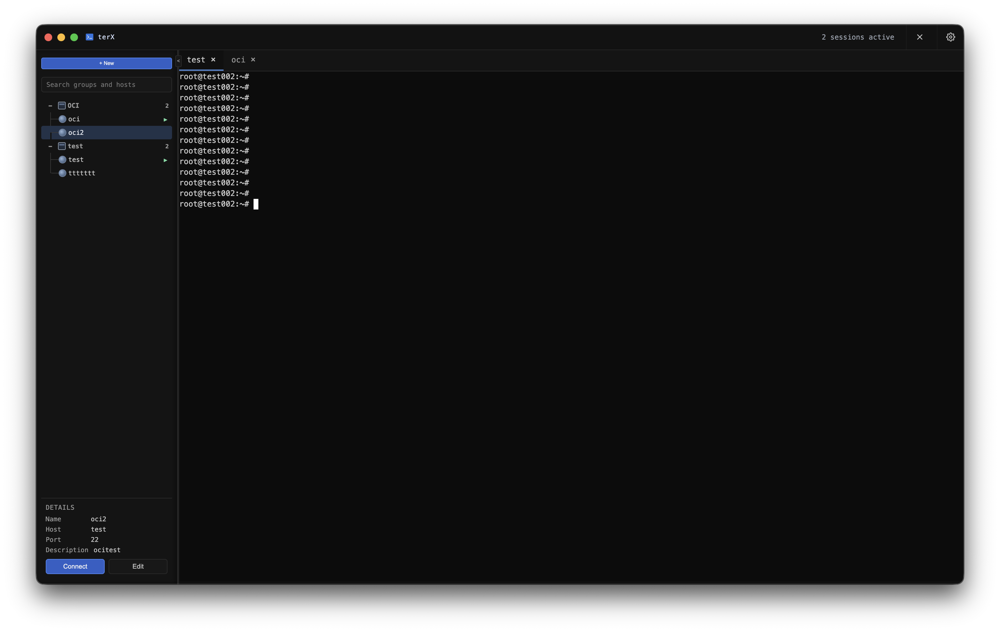
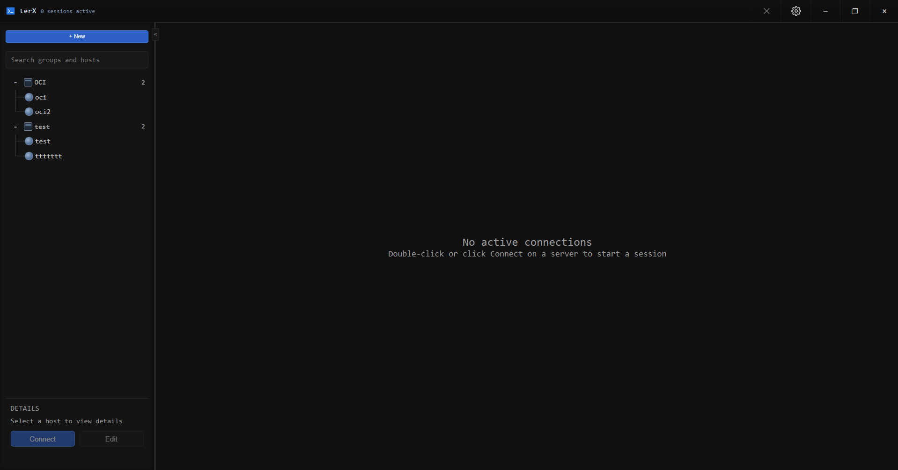

<div align="center">
  
  <h1>terX</h1>
  <p><b>A modern, secure, and fast SSH management tool for Windows and macOS.</b></p>
  
  [](https://opensource.org/licenses/MIT)
  [](#)
  [](https://electronjs.org/)
  [](https://reactjs.org/)

</div>

---

**terX** is an open-source SSH manager built with Electron, React, and TypeScript. It leverages your system's native OpenSSH client to provide robust, tabbed terminal sessions. Designed with a heavy emphasis on security, terX ensures your credentials are encrypted at rest using OS-level security APIs.

## ✨ Features

- 🖥️ **Modern Workspace** — A beautifully crafted dark theme with draggable tabs, a resizable sidebar, and ghost preview tooltips. Features native macOS glassmorphism effects for a seamless platform experience.
- 🔐 **Zero-Knowledge Encryption** — All credentials are encrypted via AES-256-CBC. The master key is securely locked inside your OS's native secure storage (Windows DPAPI or macOS Keychain via `safeStorage`), meaning only your specific user profile can decrypt it.
- 🗂️ **Smart Organization** — Group, tag, and arrange your hosts using intuitive drag-and-drop.
- 📑 **Tabbed Sessions** — Run multiple SSH sessions concurrently. Instantly duplicate or reconnect tabs.
- ⚡ **Native OpenSSH Integration** — No bundled protocol stacks. terX uses your system's `ssh.exe`, meaning it natively respects your `~/.ssh/config` and `~/.ssh/known_hosts`.
- 📤 **Secure Portable Exports** — Need to move hosts to another PC? Export them with an optional **Transfer Password**. This encrypts the file using AES-256-CBC with a PBKDF2-derived key, making it safe to transfer anywhere.

## 📸 Screenshots

<div align="center">
  
</div>

<div align="center">
  
</div>

## 🚀 Getting Started

### Prerequisites

- **OS:** Windows 10 / 11 (x64) and macOS (Intel / Apple Silicon)
- **Runtime:** [Node.js](https://nodejs.org/) (v18+) and npm
- **SSH Client:** Native OpenSSH Client

> **Note:** OpenSSH Client is natively built into macOS. On Windows, if it's not enabled, go to:
> *Settings → Apps → Optional Features → Add a feature → OpenSSH Client*

### Installation

Clone the repository and install dependencies:

```bash
git clone https://github.com/rrlabz/terX.git
cd terX
npm install
```

### Development

To run the application locally with hot-reloading (Vite + Electron):

```bash
npm start
```

### Building for Production

To compile the application into a standalone executable:

```bash
# Windows
npm run build:portable
npm run build:setup

# macOS
npm run build:mac
```
The compiled binaries will be located in the `dist/` folder.

## 🛡️ Security Architecture

terX was built from the ground up to handle your server credentials responsibly.

1. **Local-Only Storage:** Your data never leaves your computer. There are no remote syncs, telemetry, or analytics tracking.
2. **Native OS Key Protection:** The master AES-256 encryption key is protected by the Windows Data Protection API (DPAPI) or macOS Keychain. Even if another user on the same machine accesses your app data folder, they cannot decrypt the keychain.
3. **Strict Electron Sandboxing:** 
   - `contextIsolation: true` prevents the React frontend from accessing Node APIs.
   - A strict IPC whitelist ensures the renderer can only perform explicitly permitted backend actions.
4. **PBKDF2 Export Portability:** JSON exports use an optional user-provided Transfer Password. If provided, the data is encrypted via AES-256-CBC using a key derived from 100,000 PBKDF2 iterations with a random salt.

## 🛠️ Tech Stack

- **Framework:** Electron 33
- **Frontend:** React 18, Vite 8, TypeScript
- **Terminal:** `@xterm/xterm` with `@xterm/addon-fit`
- **Process Management:** `node-pty` (using prebuilt binaries to bypass Windows C++ compilation hell)
- **Cryptography:** Node `crypto` module + Electron `safeStorage`

## 👨‍💻 Developer

**Rahul R**  
GitHub: [@rrlabz](https://github.com/rrlabz)

## 📄 License

This project is open-sourced under the **[MIT License](LICENSE)**.
